# Queen Deborah's guide on how to do GNU/Linux things good and do other things good too

## Issue 1: How to make ASCII art good and learn terminal colors good too

I've been using GNU/Linux for a long time now and I've always thought there was a GLARING missing feature that to this day I'm still baffled that it's not a default feature.  You see, normally when you want to read a text file but you want more features than `more`, but mot as much bloat as `vim` you use `less` to open up that file and scroll through it, without printing the entire thing to the terminal like would happen with `cat`:

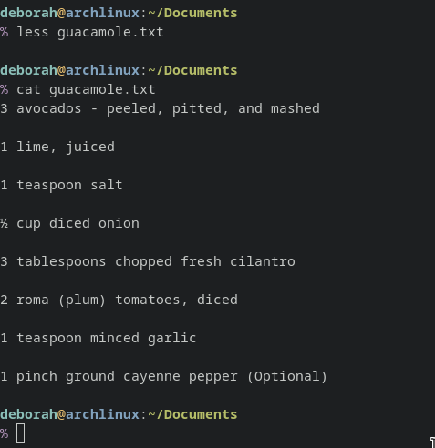

`less` is probably the command I use more than any other in my work, and probably on personal time too.  If you use `cat` or a text editor to open files in read only mode, try `less` instead! It has better scrolling features than `more` and doesn't take up as many resources as a text editor (because it is 2022 and we still worry about that). However, the glaring issue that I alluded to earlier, is that because this is the command I use most often, it's also the one I MISSPELL the most often as well, and it usually looks something like this:

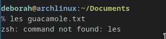

Clearly, we need something here a little gayer, and while `zsh: command not found: les` is pretty gay, I think we can do better.  None other than my most beloved Nadiekins came up with the perfect idea.  We're going to output the lesbian pride flag in ASCII each and every time we misspell `less`!


The first thing we need to do is convert that JPEG image into ASCII text, for which there are endless tools use to accomplish that goal.  Since this is a GNU/Linux tutorial, we're going to be using a command line utility to make this change.  Install [ascii-image-converter](https://github.com/TheZoraiz/ascii-image-converter) to your machine based on your specific distribution's package manager (if you have one of those fancy things) or from source if you're feeling lucky.  Refer to either the FAQ in that linked git repo or your distro's documentation on how to do that, because we will learn how to do that instead in a future issue!  For now, we'll assume you know how to install that.  According to the `--help` menu in `ascii-image-converter`, we use `-C` flag to output colour, which gives us the following:

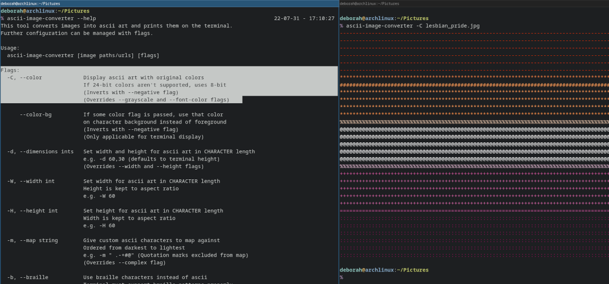

This looks okay, and can definitely work in a pinch if we wanted, but I think the rows with `#` characters look more solid, so I would like to have EVERY line look solid.  Let's save the output of this to a file so we can inspect how those colors show up.  `ascii-image-converter -C lesbian_pride.jpg > lesbian_pride.out` should save the file to `lesbian_prid.out`, which we can open in vim:

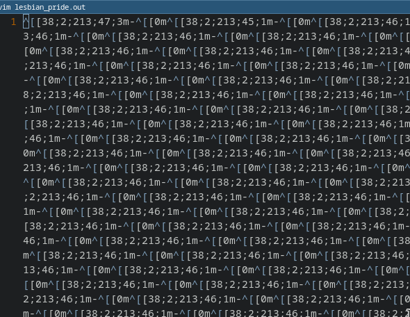

WOW!!!! Those are a whole bunch of nonsense characters!  What's going on here???  You probably do notice that this is a pattern that repeats, and that each time the patter repeats it contains a `-`, the same character we saw repeated on the top line of the flag.  That must mean that the ^[[38;2;213;47;3m must be some kind of special color code. [Chris Yeh](https://chrisyeh96.github.io/2020/03/28/terminal-colors.html) has an outstanding blog post about how these work, but in summary, the ^[ is the code generated by the `Esc` key, although this is almost never represented in text.  In order to actually output this, you need to enter `printf "\u1b"`, though you most likely won't see any output from that.  After that character is printed, the `[` means to expect a Control Sequence, the `38;2;` tells the shell that the control sequence will be 3 numbers, representing the red, blue, and green components respectively, followed by an `m` to indicate the control sequence is complete.  Finally, once that control sequence is read, the following character has that color applied to it, in this example a `#`.  Put that all together with the following:

```
% printf "\u1b[38;2;213;47;3m#" 
```
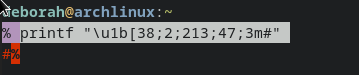

So, we just need to repeat that all the way to the end of the screen. But how do we know how many more to add? Is it 50?  It it 30? 75?  And what if the size of our terminal changes?  And how did that `ascii-art-generator` program know this too?  It seemed to fit the text to the exact width of the terminal no problem. Most user shells have a list of variables that define your environment, aptly named "Environment Variables". A list of these can be gathered at any time with the `env` command.  There are some variables that are hidden or just don't exist all the time, and one of those is `$COLUMNS`.  You can enter `$COLUMNS` at any time and it will return the number of character columns in your current terminal.  However, you can't use this directly in a script, because when a script runs, there is no visible terminal to capture that.  I'll show you how to get around that later.  For now, let's just run `echo $COLUMNS`:

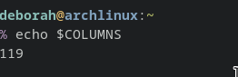

I had just mentioned that you cannot use this in a script because there is no actual terminal in the subshell running the script.  It would be to boring to explain the details of how this works in this article, but know you can use `COLUMNS=$(tput cols)` to get around this.  So, now that we know this, lets create a `for` loop that prints a single coloured `#` for each column on the screen:

```
COLUMNS=$(tput cols)
for i in $(seq 1 $COLUMNS)
do
	printf "\u1b[38;2;213;47;3m#"
done
```

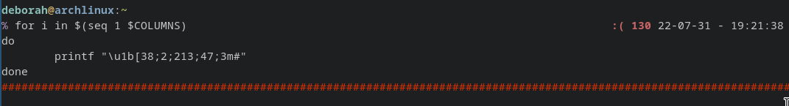

Let's put that in a loop that does that 5 times over:


```
COLUMNS=$(tput cols)
for i in {1..5}
do
	for i in $(seq 1 $COLUMNS)
	do
		printf "\u1b[38;2;213;47;3m#"
	done
done
```

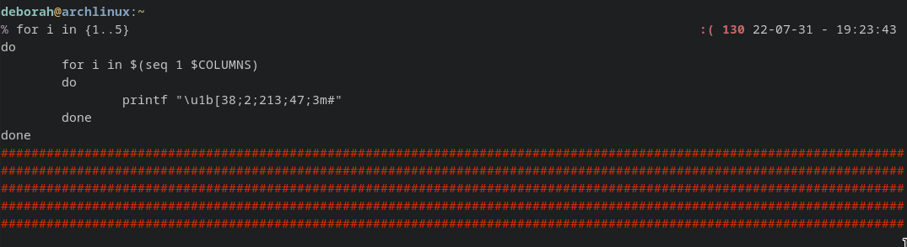

And finally, let's repeat that whole thing one time for each color of the flag (you can grab these colors from that output we made earlier, or just copy from my article because I already did the work for you!  You have to do your own work though if you want to try other pride flags):

```
COLUMNS=$(tput cols)
for x in "38;2;213;47;3m" "38;2;255;156;87m" "38;2;255;255;254m" "38;2;211;99;164m" "38;2;163;1;98m"
do
	for j in {1..5}
	do
		for i in $(seq 1 $COLUMNS)
		do
			printf "\u1b[$x#" #replace the color with $x here because each loop should be different
		done
	done
done
```

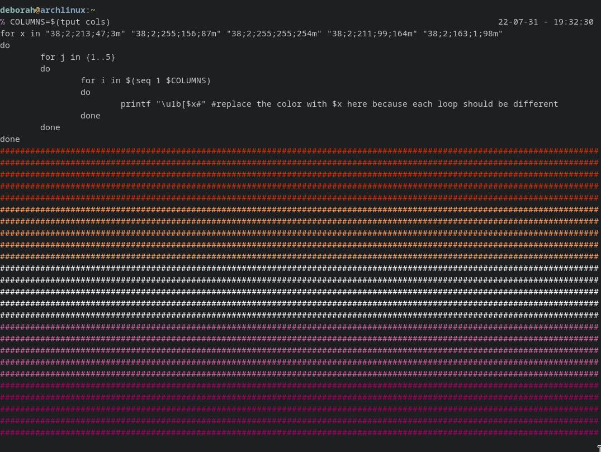

And it works! We have procedurally generated a lesbian pride flag that matches the exact width of the terminal that called it!  All we need to do now is save it to a file called `les`, give it execute permissions with `chmod +x les`, and put that file in /usr/local/bin, or any foler in your $PATH.  You can see all the folders in your $PATH just by echoing it to the terminal:


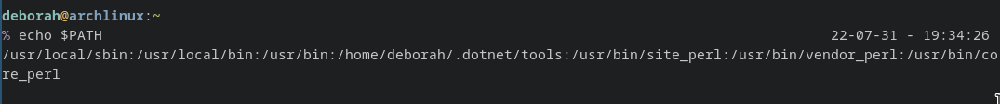

Your shell will look for command you type starting with the folder furthest to the left, and if it does not find a file matching the command you entered, it will move on to the next folder to the right of the `:`.  If it looks through each of these folders without finding your command, it will error and tell you that it cannot find what you're looking for.  You can verify a command is in your path without running it with the `which` command. Once you've done that, congratulations!  You're finished!  You can test out your VERY USEFUL lesbian pride command that outputs every time you misspell `les`


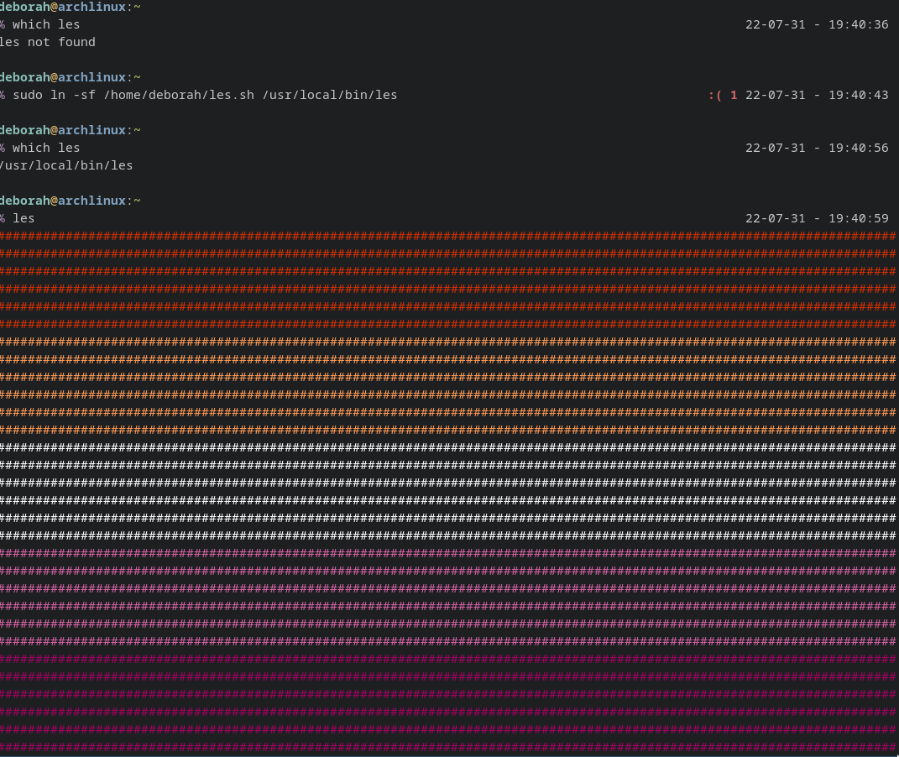
