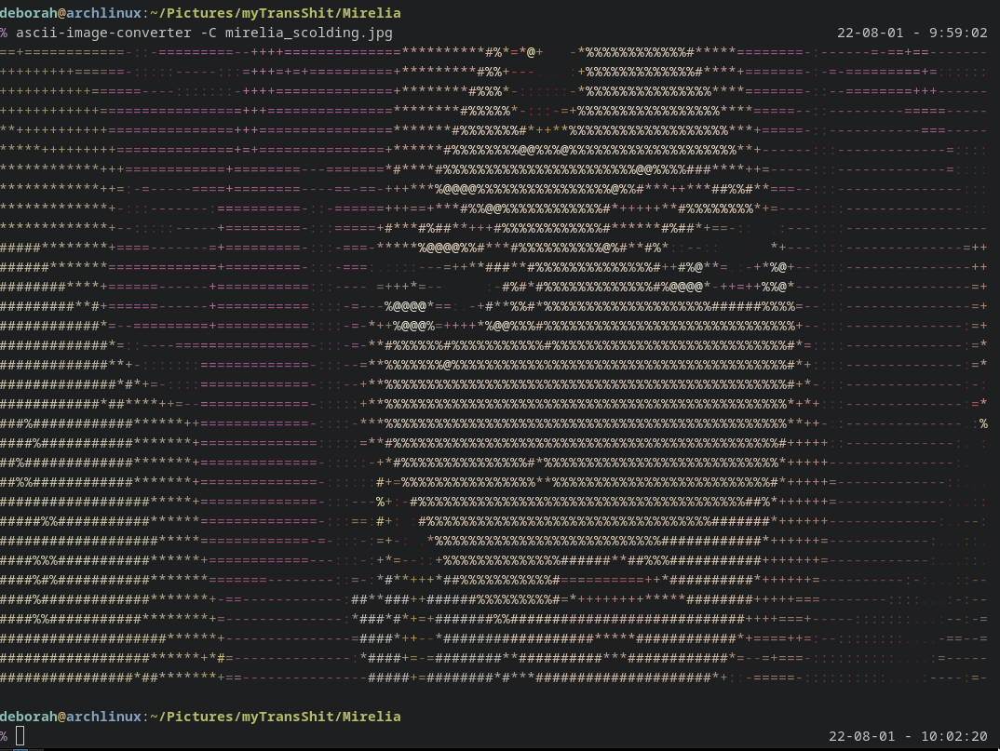
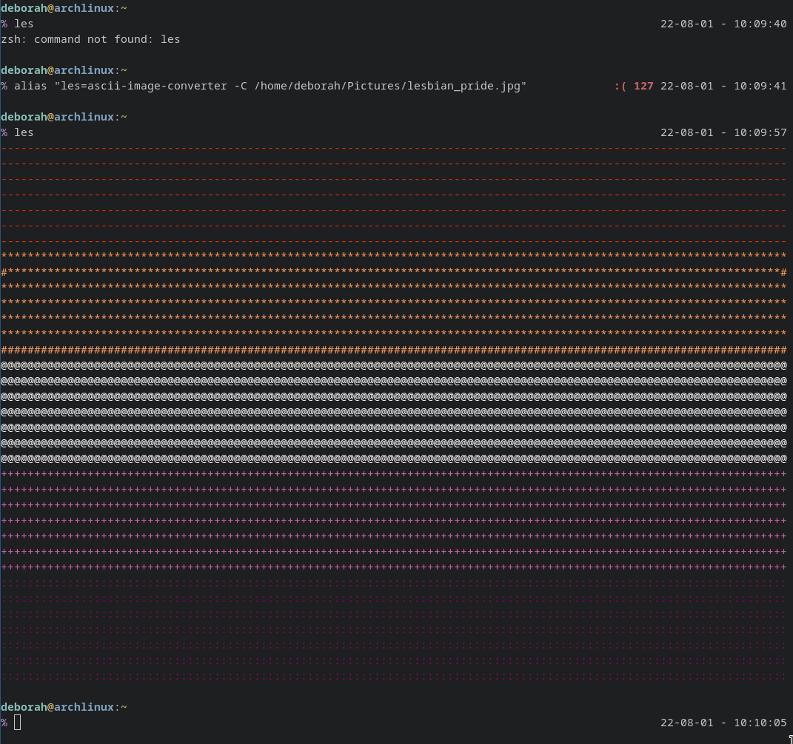

# Queen Deborah's guide on how to do GNU/Linux things good and do other things good too

## Issue 1: How to make ASCII art good and create aliases good too

###  By Queen Deborah Chrysoprase

I've been using GNU/Linux for a long time now and I've always thought there was a GLARING missing feature that to this day I'm still baffled that it's not a default feature.  You see, normally when you want to read a text file but you want more features than `more`, but not as much bloat as `vim`, you use `less` to open up that file and scroll through it, without printing the entire thing to the terminal like would happen with `cat`:


`less` is probably the command I use more often than any other in my work.  If you use `cat` or a text editor to open files in read only mode, try `less` instead! It has better scrolling features than `more` and doesn't take up as many resources as a text editor (because it is 2022 and we still worry about that). However, the glaring issue that I alluded to earlier, is that because this is the command I use most often, it's also the one I MISSPELL the most often as well, and it usually looks something like this:


Clearly, we need something here a little gayer, and while `zsh: command not found: les` is pretty gay, I think we can do better.  None other than my most beloved Nadiekins came up with the perfect idea.  We're going to output the lesbian pride flag in ASCII each and every time we misspell `less`!


The first thing we need to do is convert that JPEG image into ASCII text, for which there are endless tools to use to accomplish that goal.  Since this is a GNU/Linux tutorial, we're going to be using a command line utility to make this change.  Install [ascii-image-converter](https://github.com/TheZoraiz/ascii-image-converter) to your machine based on your specific distribution's package manager (if you have one of those fancy things) or from source if you're feeling lucky.  Refer to either the FAQ in that linked git repo or your distro's documentation on how to do that, because we will learn how to do that instead in a future issue!  For now, we'll assume you know how to install that.  According to the `--help` menu in `ascii-image-converter`, we use `-C` flag to output colour, which gives us the following:


While this looks okay, this method has the distinct advantage that we can swap in ANY picture that we want.  You can pick a different pride flag, or completely different pictures entirely, I highly reccomend pictures of your beautiful, beloved queen:



Having a tool to output any picture we want to the terminal is great, but this is only half the battle.  This doesn't do anything for us unless we get this to output when we misspell `less` as `les`.  There are MANY ways to do this, but the method we're going to explore today is the `alias` command, which literally translates one command into another command.  If you run the `alias` command without any arguments, you'll see a list of aliases already in place, many of which are shortcuts or set default options, such as with `ls`.  Each distro will probably have lots of different aliases by default, so feel free to take a look at what you have to see if there are existing shortcuts that can make your life easier!

```
deborah@archlinux:~
% alias
-='cd -'
...=../..
....=../../..
.....=../../../..
......=../../../../..
_='sudo '
afind='ack -il'
diff='diff --color'
egrep='egrep --color=auto --exclude-dir={.bzr,CVS,.git,.hg,.svn,.idea,.tox}'
fgrep='fgrep --color=auto --exclude-dir={.bzr,CVS,.git,.hg,.svn,.idea,.tox}'
g=git
```
Notice how some aliases such as `...` and `g` are shortcuts for other commands, and aliases such as `egrep` and `fgrep` provide sane default options.

So how do we create our own?  This is actually very simple!  Each of these outputs is basically the command that was used to create them.  For example, if we use the `diff` example, if we wanted to create that alias ourselves, we would take the `diff='diff --color'` output and run it with the `alias` command, like this:

`alias diff='diff --color'`

Note the quotation marks here!  If the substitution has spaces or special characters, it MUST be wrapped in either single or double quotes, single quotes are required with special characters, double quotes are sufficient for just spaces.  

Now, for our example, there's one thing we need to keep in mind - we may not always be in the same directory when we misspell `less` so we need to have an absolute path to our image, and not a relative path that we've been using.  So, when all is said and done, all we should need to do to set up our alias is the following:

`alias les='ascii-image-converter -C /home/deborah/Pictures/lesbian_pride.jpg'`



Congratulations!! You've now successfully created an alias to do something fun when you misspell a command in your terminal!  Note, that this will only last as long as you keep that terminal open, since we're running out of time I'll leave it as an exercise to the reader to figure out how to make this permanent (hint:  Check the `.bashrc` file in your home folder!).  Next issue, we'll make this flag look a little bit better, and explore another way to link this permanently! 
